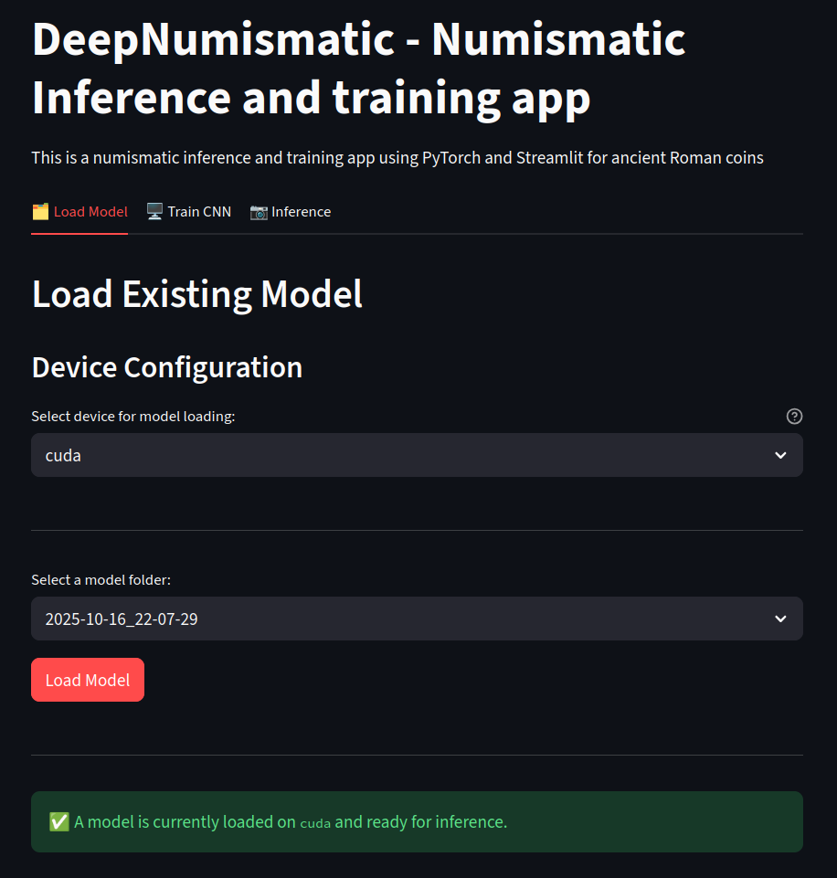
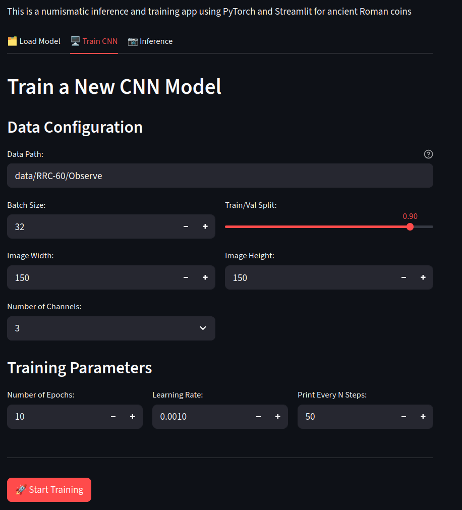
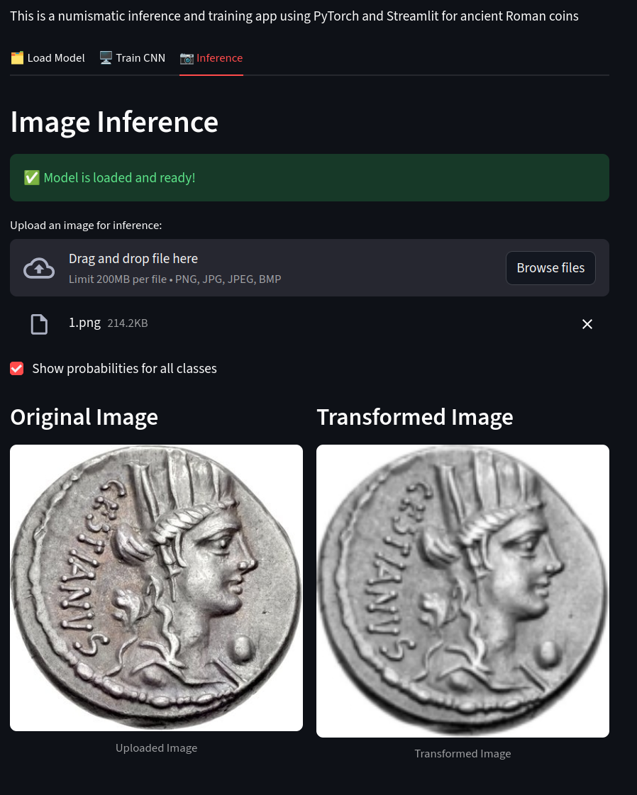
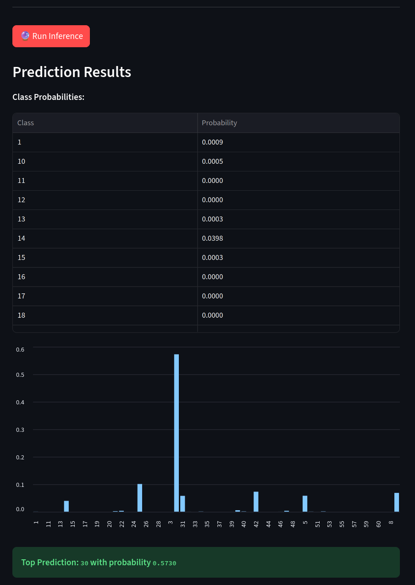

# DeepNumismatic - CNN for classifying coins

This is a simple program to pre-process images, train a CNN, and run inference on given images to classify them into one of the classes of the dataset loaded.
A useful Streamlit front-end to interact with the PyTorch application is also prepared.


## Prerequisites
- Python 3.12+
- Packages in requirements.txt (PyTorch 2.8+ and Streamlit)

## How to use the app
The main functions and the default workflow are found the main.py module, with specific functions for preparing the datasets in loader.py, 
but the Streamlit app can also be used to interact with the modules.

The main features are:
  - Train a new CNN on the coin image dataset with configurable parameters (image size, channels, batch size, epochs, learning rate, splits). The default model class defined has a decent performance after around 1500 epochs with an accuracy of 75%, which can certainly be improved
  - Load previously trained CNN models and their preprocessing transforms
  - Run inference on a single image, with or without probability table and bar chart

## How to run the Streamlit app
Steps:
1) Activate your environment and install dependencies (if not already):
   - Ensure the listed packages in the project are available in your environment (e.g., torch, torchvision, streamlit, pandas).
2) From the project root, start the app:
   ```bash
   streamlit run app.py
   ```
3) In the browser UI the three tabs are available:
##### Tab “Load Model”:



Choose device (cpu/cuda) and pick a folder under models/ to load model, transformer, and labels.

##### Tab “Train CNN”:

 
Set “Data Path” to your dataset root, adjust training params, then click “Start Training”.
 After training, artifacts are saved under models/<timestamp>/ and can be optionally loaded for inference.
 
##### Tab “Inference”:



Upload an image (png/jpg/jpeg/bmp), toggle probability mode if desired, and click “Run Inference” to see predictions.

Notes:
- The app expects the saved artifacts in a model folder: model.pth, transformer.pth, labels_mapping.pth.
- Device selection (cpu/cuda) must be compatible with your system’s availability.

## Data sources and structure

In principle any data can be used, but the data is assumed to be in organised in the following folder structure: [coin name]/[all pictures of the coin].
This project is designed and tested with the RRC-60 dataset, which contains 60 classes of Ancient Roman coins from the Republican period.
- RRC-60 dataset: https://github.com/sinemaslanx/RRC-60